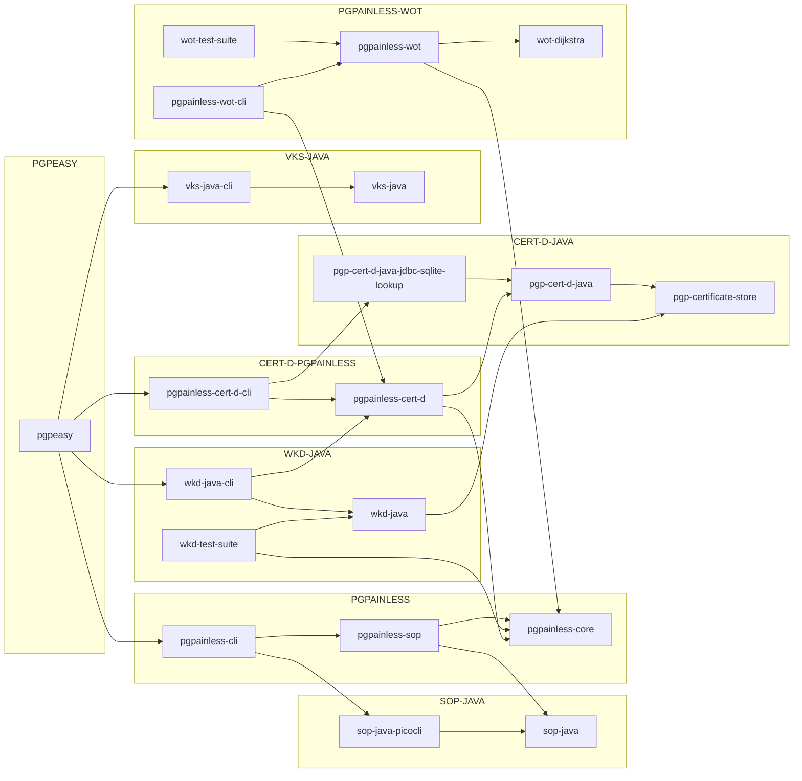

```mermaid
flowchart LR
    subgraph SOP-JAVA
    sop-java-picocli-->sop-java
    end
    subgraph PGPAINLESS
    pgpainless-sop-->pgpainless-core
    pgpainless-sop-->sop-java
    pgpainless-cli-->pgpainless-sop
    pgpainless-cli-->sop-java-picocli
    end
    subgraph WKD-JAVA
    wkd-java-cli-->wkd-java
    wkd-test-suite-->wkd-java
    wkd-test-suite-->pgpainless-core
    end
    subgraph CERT-D-JAVA
    pgp-cert-d-java-->pgp-certificate-store
    pgp-cert-d-java-jdbc-sqlite-lookup-->pgp-cert-d-java
    end
    subgraph CERT-D-PGPAINLESS
    pgpainless-cert-d-->pgpainless-core
    pgpainless-cert-d-->pgp-cert-d-java
    pgpainless-cert-d-cli-->pgpainless-cert-d
    pgpainless-cert-d-cli-->pgp-cert-d-java-jdbc-sqlite-lookup
    end
    subgraph VKS-JAVA
    vks-java-cli-->vks-java
    end
    subgraph PGPAINLESS-WOT
    wot-test-suite-->pgpainless-wot
    pgpainless-wot-->wot-dijkstra
    pgpainless-wot-cli-->pgpainless-wot
    pgpainless-wot-->pgpainless-core
    pgpainless-wot-cli-->pgpainless-cert-d
    end
    subgraph PGPEASY
    pgpeasy-->pgpainless-cli
    pgpeasy-->wkd-java-cli
    pgpeasy-->vks-java-cli
    pgpeasy-->pgpainless-cert-d-cli
    end
    wkd-java-cli-->pgpainless-cert-d
    wkd-java-->pgp-certificate-store
```