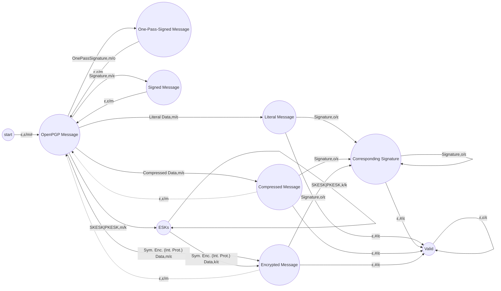

<!--
SPDX-FileCopyrightText: 2022 Paul Schaub <info@pgpainless.org>

SPDX-License-Identifier: Apache-2.0
-->

# Pushdown Automaton for the OpenPGP Message Format

See [RFC4880 §11.3. OpenPGP Messages](https://www.rfc-editor.org/rfc/rfc4880#section-11.3) for the formal definition.

A simulation of the automaton can be found [here](https://automatonsimulator.com/#%7B%22type%22%3A%22PDA%22%2C%22pda%22%3A%7B%22transitions%22%3A%7B%22start%22%3A%7B%22%22%3A%7B%22%22%3A%5B%7B%22state%22%3A%22s12%22%2C%22stackPushChar%22%3A%22%23%22%7D%5D%2C%22%23%22%3A%5B%5D%7D%7D%2C%22s0%22%3A%7B%22C%22%3A%7B%22M%22%3A%5B%7B%22state%22%3A%22s0%22%2C%22stackPushChar%22%3A%22M%22%7D%5D%7D%2C%22L%22%3A%7B%22M%22%3A%5B%7B%22state%22%3A%22s1%22%2C%22stackPushChar%22%3A%22%22%7D%5D%7D%2C%22S%22%3A%7B%22M%22%3A%5B%7B%22state%22%3A%22s0%22%2C%22stackPushChar%22%3A%22M%22%7D%5D%2C%22o%22%3A%5B%5D%7D%2C%22O%22%3A%7B%22M%22%3A%5B%7B%22state%22%3A%22s9%22%2C%22stackPushChar%22%3A%22o%22%7D%5D%7D%2C%22E%22%3A%7B%22M%22%3A%5B%5D%7D%2C%22p%22%3A%7B%22M%22%3A%5B%7B%22state%22%3A%22s6%22%2C%22stackPushChar%22%3A%22X%22%7D%5D%7D%2C%22s%22%3A%7B%22M%22%3A%5B%7B%22state%22%3A%22s6%22%2C%22stackPushChar%22%3A%22X%22%7D%5D%7D%2C%22I%22%3A%7B%22M%22%3A%5B%7B%22state%22%3A%22s8%22%2C%22stackPushChar%22%3A%22E%22%7D%5D%7D%2C%22J%22%3A%7B%22M%22%3A%5B%7B%22state%22%3A%22s8%22%2C%22stackPushChar%22%3A%22E%22%7D%5D%7D%7D%2C%22s1%22%3A%7B%22%22%3A%7B%22%22%3A%5B%5D%2C%22%23%22%3A%5B%7B%22state%22%3A%22s4%22%2C%22stackPushChar%22%3A%22%22%7D%5D%7D%2C%22S%22%3A%7B%22o%22%3A%5B%7B%22state%22%3A%22s10%22%2C%22stackPushChar%22%3A%22%22%7D%5D%7D%7D%2C%22s6%22%3A%7B%22p%22%3A%7B%22X%22%3A%5B%7B%22state%22%3A%22s6%22%2C%22stackPushChar%22%3A%22X%22%7D%5D%7D%2C%22s%22%3A%7B%22X%22%3A%5B%7B%22state%22%3A%22s6%22%2C%22stackPushChar%22%3A%22X%22%7D%5D%7D%2C%22I%22%3A%7B%22X%22%3A%5B%7B%22state%22%3A%22s8%22%2C%22stackPushChar%22%3A%22E%22%7D%5D%7D%2C%22J%22%3A%7B%22X%22%3A%5B%7B%22state%22%3A%22s8%22%2C%22stackPushChar%22%3A%22E%22%7D%5D%7D%7D%2C%22s8%22%3A%7B%22%22%3A%7B%22E%22%3A%5B%7B%22state%22%3A%22s0%22%2C%22stackPushChar%22%3A%22M%22%7D%5D%7D%7D%2C%22s9%22%3A%7B%22%22%3A%7B%22%22%3A%5B%7B%22state%22%3A%22s0%22%2C%22stackPushChar%22%3A%22M%22%7D%5D%7D%7D%2C%22s10%22%3A%7B%22%22%3A%7B%22%22%3A%5B%5D%2C%22%23%22%3A%5B%7B%22state%22%3A%22s4%22%2C%22stackPushChar%22%3A%22%22%7D%5D%7D%2C%22S%22%3A%7B%22o%22%3A%5B%7B%22state%22%3A%22s10%22%2C%22stackPushChar%22%3A%22%22%7D%5D%7D%7D%2C%22s4%22%3A%7B%22%22%3A%7B%22o%22%3A%5B%5D%7D%7D%2C%22s12%22%3A%7B%22%22%3A%7B%22%22%3A%5B%7B%22state%22%3A%22s0%22%2C%22stackPushChar%22%3A%22M%22%7D%5D%7D%7D%7D%2C%22startState%22%3A%22start%22%2C%22acceptStates%22%3A%5B%22s4%22%5D%7D%2C%22states%22%3A%7B%22start%22%3A%7B%7D%2C%22s12%22%3A%7B%22top%22%3A395.00001525878906%2C%22left%22%3A99%2C%22displayId%22%3A%22Add%20Terminal%22%7D%2C%22s0%22%3A%7B%22top%22%3A259.00001525878906%2C%22left%22%3A162%2C%22displayId%22%3A%22OpenPGP%20Message%22%7D%2C%22s1%22%3A%7B%22top%22%3A304.00001525878906%2C%22left%22%3A524%2C%22displayId%22%3A%22Literal%20Message%22%7D%2C%22s9%22%3A%7B%22top%22%3A476.00001525878906%2C%22left%22%3A282%2C%22displayId%22%3A%22One%20Pass%20Signatures%22%7D%2C%22s6%22%3A%7B%22top%22%3A100%2C%22left%22%3A324%2C%22displayId%22%3A%22ESKs%22%7D%2C%22s8%22%3A%7B%22top%22%3A202%2C%22left%22%3A471%2C%22displayId%22%3A%22Encrypted%20Data%22%7D%2C%22s4%22%3A%7B%22isAccept%22%3Atrue%2C%22top%22%3A381.00001525878906%2C%22left%22%3A832%2C%22displayId%22%3A%22Accept%22%7D%2C%22s10%22%3A%7B%22top%22%3A237.00001525878906%2C%22left%22%3A809%2C%22displayId%22%3A%22Corresponding%20Signatures%22%7D%7D%2C%22transitions%22%3A%5B%7B%22stateA%22%3A%22start%22%2C%22label%22%3A%22%CF%B5%2C%CF%B5%2C%23%22%2C%22stateB%22%3A%22s12%22%7D%2C%7B%22stateA%22%3A%22s0%22%2C%22label%22%3A%22C%2CM%2CM%22%2C%22stateB%22%3A%22s0%22%7D%2C%7B%22stateA%22%3A%22s0%22%2C%22label%22%3A%22L%2CM%2C%CF%B5%22%2C%22stateB%22%3A%22s1%22%7D%2C%7B%22stateA%22%3A%22s0%22%2C%22label%22%3A%22S%2CM%2CM%22%2C%22stateB%22%3A%22s0%22%7D%2C%7B%22stateA%22%3A%22s0%22%2C%22label%22%3A%22O%2CM%2Co%22%2C%22stateB%22%3A%22s9%22%7D%2C%7B%22stateA%22%3A%22s0%22%2C%22label%22%3A%22p%2CM%2CX%22%2C%22stateB%22%3A%22s6%22%7D%2C%7B%22stateA%22%3A%22s0%22%2C%22label%22%3A%22s%2CM%2CX%22%2C%22stateB%22%3A%22s6%22%7D%2C%7B%22stateA%22%3A%22s0%22%2C%22label%22%3A%22I%2CM%2CE%22%2C%22stateB%22%3A%22s8%22%7D%2C%7B%22stateA%22%3A%22s0%22%2C%22label%22%3A%22J%2CM%2CE%22%2C%22stateB%22%3A%22s8%22%7D%2C%7B%22stateA%22%3A%22s1%22%2C%22label%22%3A%22%CF%B5%2C%23%2C%CF%B5%22%2C%22stateB%22%3A%22s4%22%7D%2C%7B%22stateA%22%3A%22s1%22%2C%22label%22%3A%22S%2Co%2C%CF%B5%22%2C%22stateB%22%3A%22s10%22%7D%2C%7B%22stateA%22%3A%22s6%22%2C%22label%22%3A%22p%2CX%2CX%22%2C%22stateB%22%3A%22s6%22%7D%2C%7B%22stateA%22%3A%22s6%22%2C%22label%22%3A%22s%2CX%2CX%22%2C%22stateB%22%3A%22s6%22%7D%2C%7B%22stateA%22%3A%22s6%22%2C%22label%22%3A%22I%2CX%2CE%22%2C%22stateB%22%3A%22s8%22%7D%2C%7B%22stateA%22%3A%22s6%22%2C%22label%22%3A%22J%2CX%2CE%22%2C%22stateB%22%3A%22s8%22%7D%2C%7B%22stateA%22%3A%22s8%22%2C%22label%22%3A%22%CF%B5%2CE%2CM%22%2C%22stateB%22%3A%22s0%22%7D%2C%7B%22stateA%22%3A%22s9%22%2C%22label%22%3A%22%CF%B5%2C%CF%B5%2CM%22%2C%22stateB%22%3A%22s0%22%7D%2C%7B%22stateA%22%3A%22s10%22%2C%22label%22%3A%22%CF%B5%2C%23%2C%CF%B5%22%2C%22stateB%22%3A%22s4%22%7D%2C%7B%22stateA%22%3A%22s10%22%2C%22label%22%3A%22S%2Co%2C%CF%B5%22%2C%22stateB%22%3A%22s10%22%7D%2C%7B%22stateA%22%3A%22s12%22%2C%22label%22%3A%22%CF%B5%2C%CF%B5%2CM%22%2C%22stateB%22%3A%22s0%22%7D%5D%2C%22bulkTests%22%3A%7B%22accept%22%3A%22L%5CnCL%5CnCCL%5CnSL%5CnSSL%5CnSCL%5CnSpICL%5CnOLS%5CnOOLSS%5CnCspIL%5CnppppJCOLS%5CnOspILS%5CnOpJCLS%5CnOCLS%5CnCOCLS%22%2C%22reject%22%3A%22C%5CnO%5CnOL%5CnLS%5CnLL%5CnS%5Cns%5Cnp%5CnOOLS%22%7D%7D).

RFC4880 defines the grammar of OpenPGP messages as follows:
```
   OpenPGP Message :- Encrypted Message | Signed Message |
                      Compressed Message | Literal Message.

   Compressed Message :- Compressed Data Packet.

   Literal Message :- Literal Data Packet.

   ESK :- Public-Key Encrypted Session Key Packet |
          Symmetric-Key Encrypted Session Key Packet.

   ESK Sequence :- ESK | ESK Sequence, ESK.

   Encrypted Data :- Symmetrically Encrypted Data Packet |
         Symmetrically Encrypted Integrity Protected Data Packet

   Encrypted Message :- Encrypted Data | ESK Sequence, Encrypted Data.

   One-Pass Signed Message :- One-Pass Signature Packet,
               OpenPGP Message, Corresponding Signature Packet.

   Signed Message :- Signature Packet, OpenPGP Message |
               One-Pass Signed Message.

   In addition, decrypting a Symmetrically Encrypted Data packet or a
   Symmetrically Encrypted Integrity Protected Data packet as well as
   decompressing a Compressed Data packet must yield a valid OpenPGP
   Message.
```

This grammar can be translated into a [pushdown automaton](https://en.wikipedia.org/wiki/Pushdown_automaton) with
the following graphical representation:



Formally, the PDA is defined as $M = (\mathcal{Q}, \Sigma, \Upgamma, \delta, q_0, Z, F)$, where
* $\mathcal{Q}$ is a finite set of states
* $\Sigma$ is a finite set which is called the input alphabet
* $\Upgamma$ is a finite set which is called the stack alphabet
* $\delta$ is a finite set of $\mathcal{Q}\times(\Sigma\cup\textbraceleft\epsilon\textbraceright)\times\Upgamma\times\mathcal{Q}\times\Upgamma^*$, the transition relation
* $q_0\in\mathcal{Q}$ is the start state
* $Z\in\Upgamma$ is the initial stack symbol
* $F\subseteq\mathcal{Q}$ is the set of accepting states

In our diagram, the initial state is $q_0 = \text{start}$.
The initial stack symbol is $Z=\epsilon$ (TODO: Make it `#`?).
The set of accepting states is $F=\textbraceleft\text{valid}\textbraceright$.
$\delta$ is defined by the transitions shown in the graph diagram.

The input alphabet $\Sigma$ consists of the following OpenPGP packets:
* $\text{Literal Data}$: Literal Data Packet
* $\text{Signature}$: Signature Packet
* $\text{OnePassSignature}$: One-Pass-Signature Packet
* $\text{Compressed Data}$: Compressed Data Packet
* $\text{SKESK}$: Symmetric-Key Encrypted Session Key Packet
* $\text{PKESK}$: Public-Key Encrypted Session Key Packet
* $\text{Sym. Enc. Data}$: Symmetrically Encrypted Data Packet
* $\text{Sym. Enc. Int. Prot. Data}$: Symmetrically Encrypted Integrity Protected Data Packet

Additionally, $\epsilon$ is used to transition without reading OpenPGP packets or popping the stack.

The following stack alphabet $\Upgamma$ is used:
* $m$: OpenPGP Message
* $o$: One-Pass-Signature packet.
* $k$: Encrypted Session Key
* `#`: Terminal for valid OpenPGP messages

Note: The standards document states, that Marker Packets shall be ignored as well.
For the sake of readability, those transitions are omitted here.

The dotted line indicates a nested transition.
For example, the transition $(\text{Compressed Message}, \epsilon, \epsilon, \text{OpenPGP Message}, m)$  indicates, that the content of the
Compressed Data packet itself is an OpenPGP Message.
